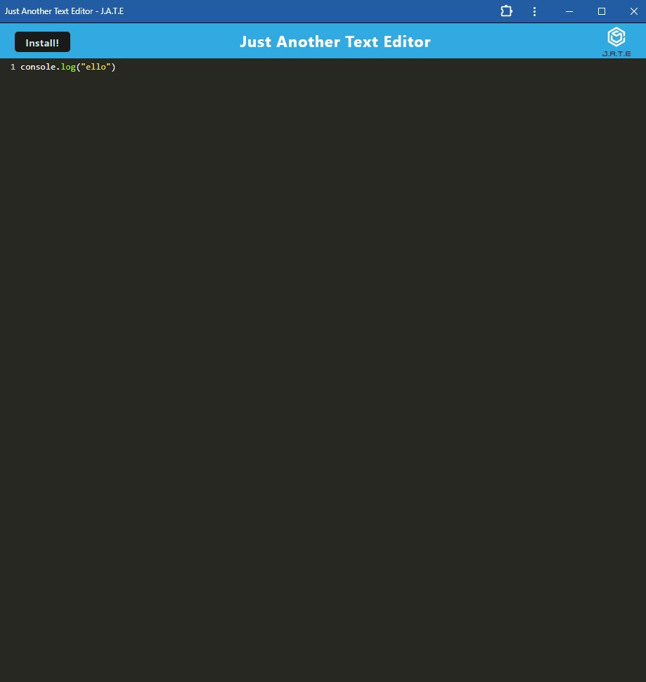

# Text-editor-plus

A PWA text editor!

[](https://opensource.org/licenses/MIT)

---

## Contents

1. [About](#about)
2. [Story](#user-story)
3. [Visuals](#visuals)
4. [Installation](#installation)
5. [License](#license)
6. [Contributing](#contributing)
7. [Contact](#contact)

---

## About

Starter code for this application originates from GitHub user cautious-meme.

This PWA application is built for text editing. Anyt and every thought or piece of code that once crossed your mind can now cross this application and be saved with or without internet connection. Additionally, this application is able to be saved to your computer with the simple click of a button.

Link to working appllication: 

---

### User Story

```
AS A developer
I WANT to create notes or code snippets with or without an internet connection
SO THAT I can reliably retrieve them for later use
```

## Visuals:



---

## Installation:

```
To clone the repo:

git clone in gitbash
```

---

## License

License used for this project - MIT

- For more information on license types, please reference this website
  for additional licensing information - [https://choosealicense.com/](https://choosealicense.com/).

---

## Contributing:

To contribute to this application, create a pull request.
Here are the steps needed for doing that:

- Fork the repo
- Create a feature branch (git checkout -b NAME-HERE)
- Commit your new feature (git commit -m 'Add some feature')
- Push your branch (git push)
- Create a new Pull Request

Following a code review, your feature will be merged.

---

## Contact:

- GitHub Username: [conquerersHaki](https://github.com/conquerersHaki)
- GitHub Email: keighleychristina@yahoo.com